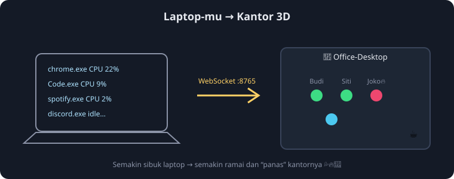

# 🏢 Office-Desktop

**Simulasi kantor 3D di mana karyawannya adalah aplikasi yang berjalan di laptopmu.**

Semakin ramai proses dan semakin tinggi CPU laptopmu, semakin sibuk pula kantornya:
karyawan mengetik makin cepat, keringat 💦 keluar, api 🔥 menyala, kipas plafon berputar
ngeras, sampai asap mengepul dari gedung saat beban kritis. Tutup sebuah aplikasi?
Karyawannya langsung *resign* 📤. Buka aplikasi baru? Langsung *diterima bekerja* 📥.



## Cara menjalankan

### Windows
```bat
start_windows.bat
```
(otomatis membuat virtualenv, menginstal `psutil` & `websockets`, lalu membuka browser)

### Linux / macOS
```bash
pip install psutil websockets
python run.py            # data asli dari proses desktop
python run.py --demo     # mode demo tanpa membaca proses asli
```

Lalu buka **http://localhost:8000**. Backend WebSocket jalan di `ws://localhost:8765`.

> Catatan: pada Windows, jalankan dari terminal biasa agar bisa melihat log.
> Beberapa proses sistem mungkin tidak terbaca tanpa hak akses admin — itu wajar,
> mereka memang "tidak diizinkan masuk kantor". 😄

## Peta konsep

| Data desktop              | Di dunia kantor                 |
|---------------------------|---------------------------------|
| Proses/aplikasi berjalan  | Karyawan (robot mungil bernama) |
| % CPU per proses          | Kesibukan kerja (kecepatan ngetik, 💦, 🔥) |
| RAM (RSS)                 | Beban di meja (gelas kopi muncul saat >55%) |
| Jumlah thread             | "Banyak tangan" yang dipakai kerja |
| Nama proses               | Profesi: Chrome→Web Surfer, Code→Code Wizard, Spotify→DJ Intern… |
| CPU total laptop          | Suasana kantor: langit, lampu, kecepatan kipas, asap |
| Proses dibuka/ditutup     | Karyawan masuk/resign (toast notifikasi) |
| Kursi habis (>64 proses)  | Nongkrong di pantry ☕ |

## Kontrol
- **Drag** = putar kamera, **scroll** = zoom
- **Klik karyawan** (di 3D atau di daftar kanan) = panel detail
- **1–4** = preset sudut kamera, **R** = reset

## Struktur proyek
```
office-desktop/
├── start_windows.bat     # launcher satu-klik utk Windows
├── run.py                # launcher lintas-platform (HTTP + WS + browser)
├── requirements.txt
├── backend/
│   ├── server.py         # WebSocket server (broadcast snapshot tiap detik) + mode --demo
│   └── monitor.py        # psutil → karyawan (kategori, nama, kesibukan, alokasi kursi)
└── web/
    ├── index.html        # HUD (statistik, roster, toast, detail)
    └── js/
        ├── main.js       # loader three.js (CDN + fallback), WS client, interaksi
        ├── world.js      # scene, kamera, dinamis lighting/asap/kipas, render loop
        ├── office.js     # gedung: lantai, cubicle, pantry, ruang rapat, jendela kota
        ├── worker.js     # karakter: animasi duduk/ngetik/jalan/meeting, properti meja
        └── factory.js    # tekstur canvas (layar IDE/chat/webpage), sprite nama & emoji
```

## Tips performa
- Three.js dimuat dari CDN (jsDelivr → unpkg → esm.sh). Butuh internet **sekali**; setelahnya cache browser membantu.
- Kalau ingin 100% offline: unduh `three.module.js` + `OrbitControls.js` ke `web/vendor/` lalu ubah URL di `main.js`.
- Interval snapshot bisa diatur: `python backend/server.py --interval 2`.
